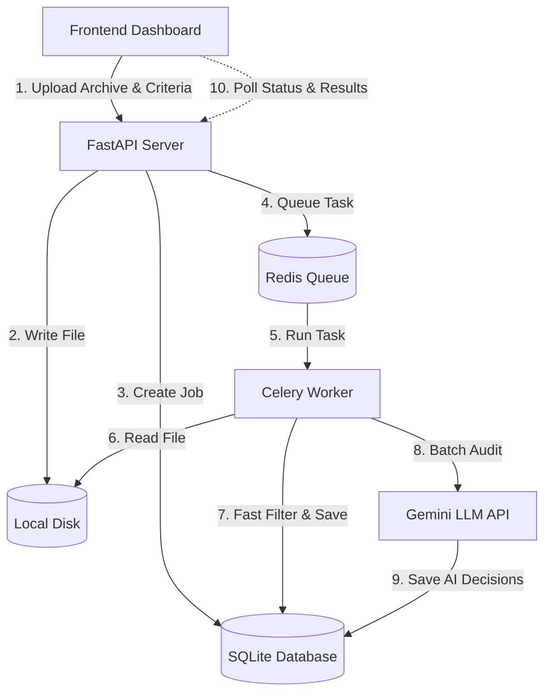

# Tweet Audit AI

Tweet Audit AI is a high-performance, asynchronous batch-processing tweet audit and deletion-review system. It consists of a FastAPI backend server, a Celery task queue, a SQLite database, and a sleek, interactive frontend dashboard. The system evaluates Twitter/X archive uploads, performs fast regex keyword filtering to discard/flag unwanted tweets immediately, and executes asynchronous batch reviews of the remaining tweets using the Gemini LLM.

## Features

- **Asynchronous Processing**: Heavy computations (ZIP extraction, parsing, and LLM auditing) are fully offloaded to Celery background workers to keep the API server responsive.
- **Two-Stage Audit Filter**:
  - **Stage 1 (Regex & Fast Scan)**: Immediate, low-cost pre-filtering based on custom forbidden words and retweets (`RT @`).
  - **Stage 2 (AI-Powered Audit)**: Leverages Gemini (e.g., `gemini-2.5-flash`) for deep, context-aware audits against professional guidelines and political tone check.
- **Resilience & Rate-Limiting**:
  - **Token Bucket Limiting**: Enforces requests-per-minute (RPM) and requests-per-day (RPD) limits.
  - **Circuit Breaker Pattern**: Automatically opens and fails fast during persistent downstream AI failures to avoid cascading issues.
  - **Exponential Backoff Retries**: Automatically retries transient API failures with randomized jitter.
  - **Startup Sweeper**: Scans and restarts tasks for interrupted/crashed jobs upon Celery worker startup to prevent orphaned processes.
- **Sleek Web Interface**: Real-time progress tracking, customized auditing settings, interactive tweet audits ledger (categorized by Safe, Flagged, and All), and CSV export.

---

## Architectural Flow



---

## Process Flow

1. **Upload & Queueing**:
   - A user uploads a Twitter archive file (`.zip` containing `tweets.js` or a raw `.js` file) with custom audit parameters (forbidden words, professional rules, target tone, political exclusion) from the frontend dashboard.
   - FastAPI validates the file, registers a new job in SQLite, writes the uploaded file to the local disk, and dispatches a parsing task to the Celery worker via Redis.
2. **Parsing & Early Keyword Scan**:
   - The Celery worker extracts the tweets, running a regex pre-filter to instantly flag and isolate tweets matching forbidden keywords or retweets.
   - Flagged tweets are set to a status of `flagged_filter`, while remaining tweets are marked as `pending_llm`. All tweets are committed to the SQLite database.
3. **AI Audit Execution**:
   - The worker triggers the `agent_review` task which gathers all `pending_llm` tweets, groups them into batches of 100, and fires parallel API requests (up to 3 concurrently) using an asynchronous semaphore.
   - The downstream agent wrapper runs requests against the Gemini API, protected by a Redis-backed rate limiter (RPM/RPD token buckets) and a circuit breaker.
   - On successful response, the database commits the classification (`safe` vs. `flagged_llm`) and Gemini's short explanation reason.
4. **Monitoring & Download**:
   - The web interface polls the API to display real-time progress bars, counters, and the detailed audited tweet ledger.
   - Users can filter results and stream download the completed CSV audit report.

---

## Prerequisites

- **Python**: Version `3.13` or newer.
- **uv**: A fast Python package installer and manager.
- **Redis**: A running instance on `localhost:6379` (used for Celery broker, rate limits, and circuit breaker persistence).
- **Gemini API Key**: An active Google Gemini API Key.

---

## Installation Guide

1. **Configure Environment Settings**:
   Copy the example configuration file:
   ```bash
   cp config.example.json config.json
   ```
   Open `config.json` and insert your Gemini API Key:
   ```json
   {
       "database_url": "sqlite:///database.db",
       "gemini_api_key": "YOUR_GEMINI_API_KEY_HERE",
       "redis_host": "localhost",
       "redis_port": 6379
   }
   ```

2. **Start Redis**:
   Make sure Redis is running. For example, via Docker:
   ```bash
   docker run -d -p 6379:6379 redis
   ```

3. **Install Dependencies**:
   Initialize the virtual environment and install all packages using `uv`:
   ```bash
   uv sync
   ```

---

## Startup Guide

Run the main startup script:
```bash
uv run main.py
```

### What this script does:
- Starts the **Celery Worker** process (`celery -A src.celery_worker.celery_client worker --loglevel=info --pool=solo`) which acts as the asynchronous backend task executor.
- Starts the **FastAPI Web Server** (`uvicorn src.main:app --port 8001`) which hosts the REST API endpoints.
- Monitors both processes and gracefully shuts them down when you press `Ctrl+C`.

### Launching the Frontend:
Because the UI is built with vanilla HTML/CSS/JavaScript, it does not require a build step. You can view the dashboard by:
- Directly opening `simple-ui/index.html` in your browser.
- Or running a simple local server:
  ```bash
  python -m http.server -d simple-ui 8000
  ```
  Then, navigate to `http://localhost:8000` in your web browser.

---

## Architectural Decisions & Trade-offs

For a detailed analysis of the performance versus safety trade-offs, concurrency strategy, retry patterns, and error handling mechanisms, see [TRADEOFFS.md](TRADEOFFS.md).

 
