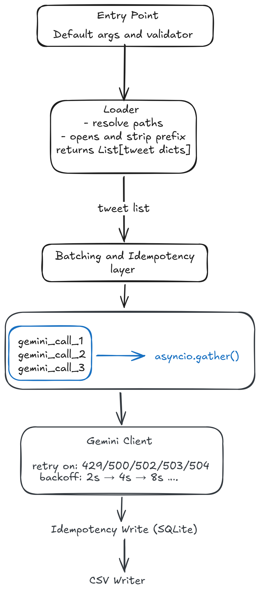

# tweet-audit

A CLI tool that audits your Twitter/X data export, uses Google Gemini to flag tweets you may want to delete, and writes the results to a CSV — safely resumable at any point.

---

## What it does

1. Reads your `tweets.js` file (from a Twitter/X data export)
2. Strips the JavaScript assignment prefix so the file can be parsed as JSON
3. Sends tweets to Gemini in batches for AI-based content auditing
4. Persists each result to a local SQLite database so no tweet is sent to Gemini twice
5. Writes a final `tweets.csv` with three columns: `id_str`, `flagged`, `reason`

---

## Architecture




---

## Project structure

```
tweets-audit/
├── src/
│   ├── main.py           # Orchestrator: batching, rate limiting, CSV write
│   ├── loader.py         # File reader and JSON parser
│   ├── gemini_client.py  # Gemini API wrapper with retry logic
│   ├── db_config.py      # SQLite idempotency store (SQLModel)
│   ├── settings.py       # Config loader (reads config.json)
│   └── logger.py         # Shared stdout logger
├── config.json           # API keys (not committed — see setup below)
├── tweets.js             # Your Twitter data export (not committed)
├── TRADEOFFS.md          # Architecture and design decision notes
└── README.md
```

---

## Setup

### 1. Clone and create a virtual environment

```bash
git clone <repo-url>
cd tweets-audit
python -m venv .venv
source .venv/bin/activate      # Windows: .venv\Scripts\activate
```

### 2. Install dependencies

```bash
pip install google-genai sqlmodel pydantic
```

### 3. Create `config.json`

Copy the example config and fill in your values:

```bash
cp config.example.json config.json
```

`config.json` structure:

```json
{
    "database_url": "sqlite:///database.db"
}
```

> The Gemini API key is **not** stored in config — it is entered securely at runtime via a terminal prompt.

### 4. Add your Twitter data export

Place your `tweets.js` file anywhere accessible. The tool will prompt you for the path at runtime.

---

## Running the tool

```bash
cd src
python main.py
```

You will be prompted for:

| Prompt | Example input |
|--------|---------------|
| File path | `tweets.js` or an absolute path |
| Prefix to strip | `window.YTD.tweets.part0 = ` |
| Gemini API key | (entered securely via getpass) |

The tool will log progress to stdout and write results to `src/tweets.csv` when done.

---

## Output

`tweets.csv` contains one row per tweet:

| Column | Type | Description |
|--------|------|-------------|
| `id_str` | string | Twitter tweet ID |
| `flagged` | bool | Whether Gemini flagged the tweet for deletion |
| `reason` | string / null | One-sentence reason (null if not flagged) |

---

## Flagging criteria

Gemini flags a tweet if it:

- Complains bitterly or unprofessionally about a tool, language, or technology
- Expresses frustration about work, colleagues, or the industry
- Is a retweet with no original thought (starts with `RT @`)
- Makes a hot take or controversial claim that could age poorly
- Is vague, low-effort, or adds no value

It does **not** flag tweets that share genuine insights, are constructive in tone, or celebrate milestones professionally.

---

## Resumability

The SQLite database (`src/database.db`) stores every processed tweet. If the tool crashes or is interrupted mid-run, restart it with the same inputs — already-processed tweets are skipped automatically and no duplicate Gemini calls are made.

---

## Design decisions

See [TRADEOFFS.md](./TRADEOFFS.md) for a full explanation of:

- Why async + semaphore instead of sequential or threaded
- Why SQLite for idempotency
- Batch size choices (1000 outer / 100 Gemini)
- Retry strategy and error handling approach
